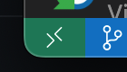

# やっぱり地元愛
## チームメンバ
- プロダクトオーナー: 池上太一(いっちー)[IkegamiXYZ](https://github.com/IkegamiXYZ)
- テックリード: 尾崎克明(ざっきー)[ozuaq](https://github.com/ozuaq)
- スクラムマスター: 倉持慧輔(もっちー)[]()、鈴木中穂美(ずっきー)[nsuzuki41](https://github.com/nsuzuki41)

## プロダクト案
- [コンセプト、概要、展望](https://drive.google.com/file/d/1ASZznrLixWlXT2C6rCwK6eVaFITpxh-S/view?usp=sharing)

## 使用技術
- Webフレームワーク: [Django](https://www.djangoproject.com/)
- オープンデータ:
  - マップ: [OpenStreetMap](https://www.openstreetmap.org/)
- ライブラリ・API:
  - Webページの動的な描画: [Vue.js](https://ja.vuejs.org/)
  - マップ操作: [Leaflet](https://leafletjs.com/)
  - 位置情報取得: [Geolocation API](https://developer.mozilla.org/ja/docs/Web/API/Geolocation_API)
  - 音声読み上げ: [Web Speech API](https://developer.mozilla.org/ja/docs/Web/API/Web_Speech_API)

## セットアップ
**docker環境の構築**

**windows osの人**
1. 以下記事を参考にWSL2+Ubuntu環境を構築する 

※以下記事の目次の中で セットアップの流れ だけ参考にする

[Windows+WSL2+Ubuntu22.04+VS Code Dev ContainerでWEBシステム開発しよう！](https://zenn.dev/algovitae/articles/2022devcontainer)

2. docker desktop アプリを入れる 

[ダウンロードリンク](https://www.docker.com/products/docker-desktop/)

3. docker desktop アプリを起動

**mac osの人**
1. docker desktop アプリを入れる 

[ダウンロードリンク](https://www.docker.com/products/docker-desktop/)

2. docker desktop アプリを起動

**セットアップの続き**

1. Visual Studio Code(vscode) アプリを入れる
2. vscode アプリを起動

[ダウンロードリンク](https://azure.microsoft.com/ja-jp/products/visual-studio-code/)

3. vscodeの拡張機能に Dev Containers を入れる


5. このリポジトリをローカルの好きなフォルダにcloneする

```
git clone https://github.com/自分のgithubアカウント名//inet_b_treasure_map.git
```
例）
```
git clone https://github.com/ozuaq/inet_b_treasure_map.git
```

5. プロジェクトフォルダに移動する

```
cd inet_b_treasure_map
```

6. vscodeの左下から Reopen in Container を押す



**vscodeのターミナルで以下の作業を行う**

7. マイグレーションを実行する

```
python manage.py migrate
```

## webサーバ起動
```
python manage.py runserver 0.0.0.0:8887
```
### **サイトにアクセス**
http://52.195.12.37//inet_b_hackathon/treasure_map/zoom_out_map/

## Git
### **gitでの作業方法**

**自分のブランチを作る**

例）

自分のブランチを作って、自分のブランチに切り替える

```
git checkout -b ozaki_develop
```

自分のブランチで作業をする

区切りがいいところまで出来たら、コミットする

併せて下に書いてある非追跡ファイルの設定も読んでください

**編集したファイルを追跡ファイルに追加する**

```
git add .
```

コミットする

```
git commit -m "ここに変更内容を書いてください"
```

**mainにマージする**
mainブランチに切り替える

```
git checkout main
```

自分のブランチをmainブランチにマージする

例)

```
git merge ozaki_develop
```
**プルリクエストを投稿する**

※あとで上の工程まで進んだ人が居た時にみんなで知識共有します

### **非追跡ファイル設定**
- 開発メンバ共通で非追跡にしたいファイルの非追跡設定 <br>
.gitignoreに書く <br>
- 個人的なファイルの非追跡設定<br>
.git/info/excludeに書く <br>

## Django
### **フロントエンド**
- static/ <br>
css・image・jsファイルの配置場所
<br>
例）
<br>
static/css/sample.css
- template/ <br>
テンプレート(HTML)ファイルの配置場所
<br>
template/sample.html

### **バックエンド(あとで勉強したい人のため共有)**
- treasure_map/urls.py <br>
プロジェクトのURLを設定
- mysite/urls.py <br>
アプリのURL設定とmysite/views.py中のview関数と対応付け
- mysite/views.py <br>
データベースとのやりとり・必要な処理・次の遷移先ページといった内容を定義したview関数を書く
- mysite/models.py <br>
データベースのテーブルをclassとして定義

## 番外編 本番環境にデプロイする
**コンテナをバックグラウンドで起動**
```
docker-compose up -d
```
-d を付けるとコンテナをバックグラウンドで起動

**コンテナの停止**
```
docker-compose stop
```
